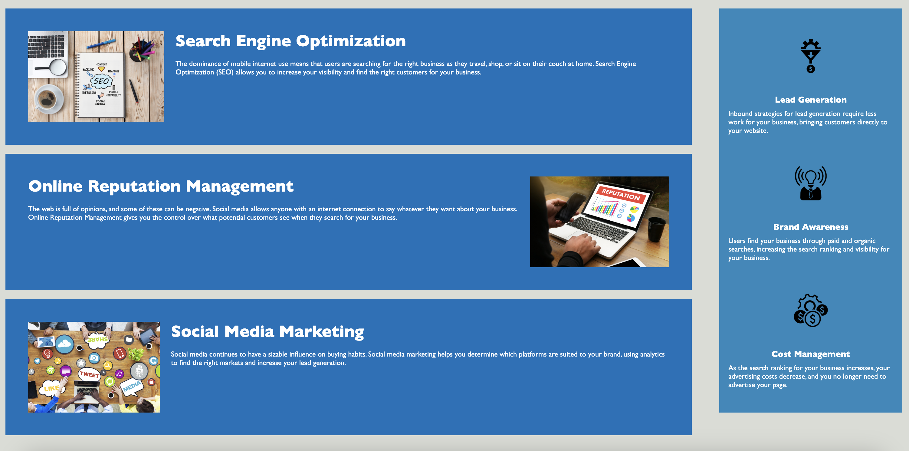

# Horiseon Website Refactor

## Description

The Horiseon Website Refactor project aims to improve the codebase for accessibility and maintainability. By refactoring the existing HTML and CSS code, this project ensures that the website meets modern standards and is easier to maintain and navigate.

## Live Link

The live version of the website can be accessed [here](https://pradeepkhanal23.github.io/horiseon-website-refactor/){:target="\_blank"}

## Screenshots

_Description: The homepage showcases the easy navigation bar and hero section._

_Description: The content page showcases the contents and the benefits sections respectively._

## Installation

To run this project locally, follow these steps:

1. Clone this repository.
2. Open the project directory.
3. Open the `index.html` file in your preferred web browser.

## Technologies Used

- HTML5
- CSS3

## License

This project is licensed under the [MIT License](LICENSE).
